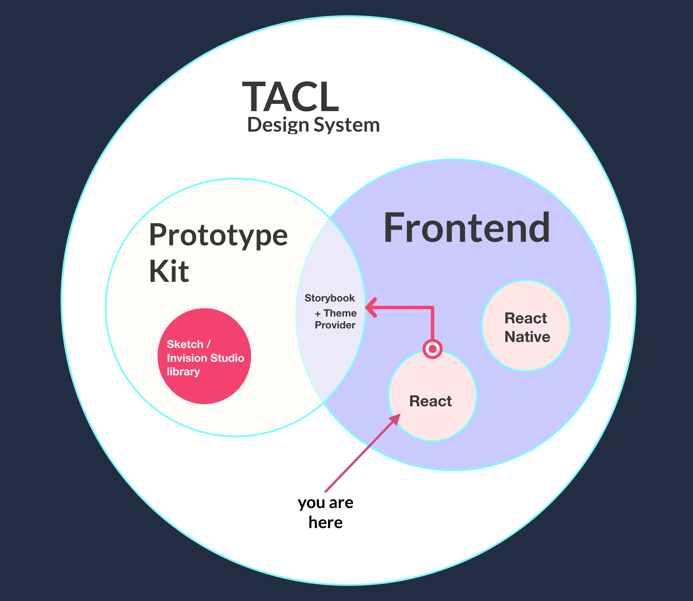

# Apptitude Tacl

## Intro

The TACL is a **component library** and **design system**. It's aim is to reduce/eliminate the many tedious and unproductive hours spent designing and coding *from scratch* common UI components by providing a comprehensive library of robust and flexible components. This here is the *React* arm of the component library.

## Getting Started

### 🏄 Setup

* git clone [git@github.com:ch-apptitude/ch_apptitude_TACL.git](https://github.com/ch-apptitude/ch_apptitude_TACL)
* cd `ch_apptitude_TACL`
* Install node modules; run `npm i` or `yarn`

### ▶️ Run

* Run `npm run storybook` or `yarn storybook`

### 🔨 Build

* Pull down the `dev` branch for beta or `master` for stable.

#### For development

* Run `npm run build:watch` or `yarn build:watch`
* Run `npm link` or `yarn link`
* In the root of your project directory run `npm link "tacl"` or `yarn link "tacl"`

#### For production

* Run `npm run build:library`

### 🥁 Release

* Merge into master
* Run `git tag <tagname>`
* Run `git push origin master && git push --tags`
* Post release notes in `#project-tacl` slack channel.

## 📐 Contributing

Whilst there is no formal contribution procedure (PRs etc) in place yet, here are some general guidelines to ensure the quality of the code and help us maintain robust components.

* Use [git-flow](https://danielkummer.github.io/git-flow-cheatsheet/) 💪
* **Document your changes**, no matter how small: typically this means adding to or updating the [stoybook file](./.storybook/stories.js) (inc. code examples).
* Add a Trello card for what you're working on, if it's a bug fix use the bug report template (see [Bug Reporting](#bug-reporting)).

### 🐛 Bug Reporting

There is a bug report template on the TACL Trello board. Duplicate this card and enter/modify your details then add it to the **backlog**.
